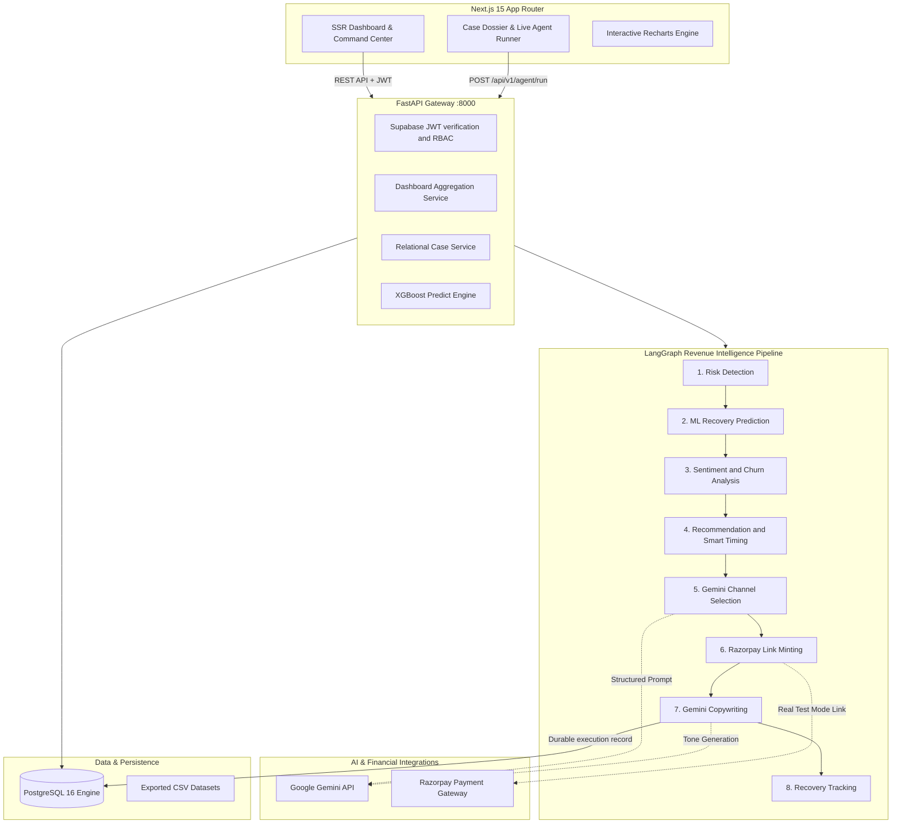
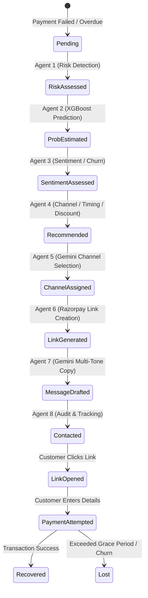
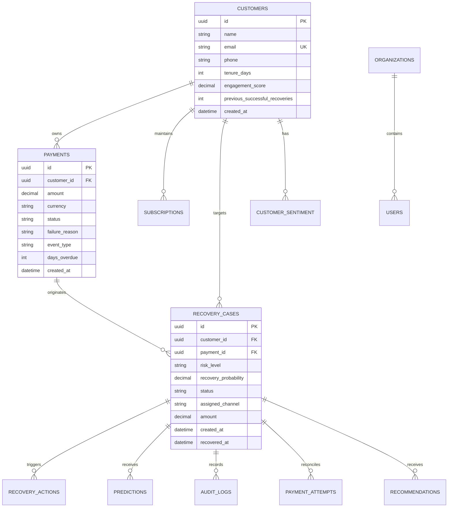

# RecoverAI — System Architecture & Multi-Agent Flow

RecoverAI is an autonomous, agentic revenue recovery platform that monitors financial leakage, predicts recovery probabilities with classical ML, and orchestrates personalized multi-channel outreach through a stateful multi-agent LangGraph workflow.

---

## 1. High-Level System Architecture

---

## 2. Multi-Agent Finite State Machine

---

## 3. Database Entity Relationship Model

